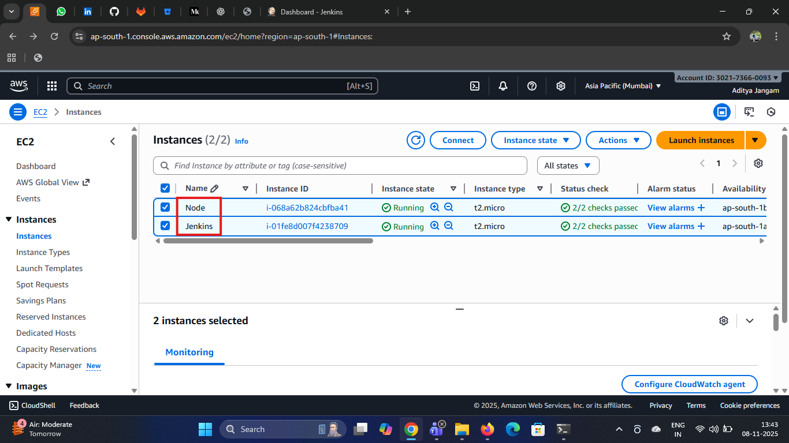
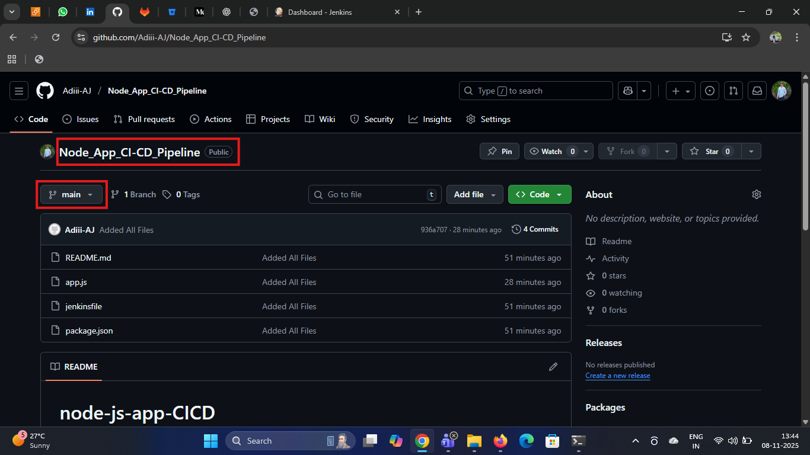
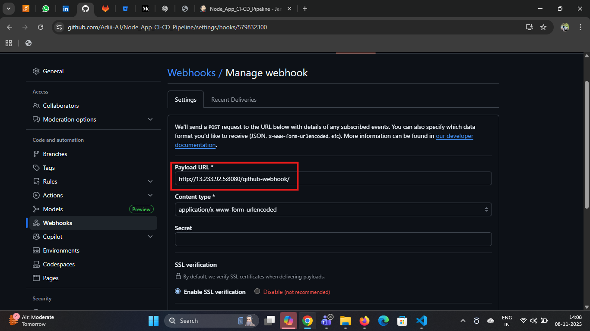
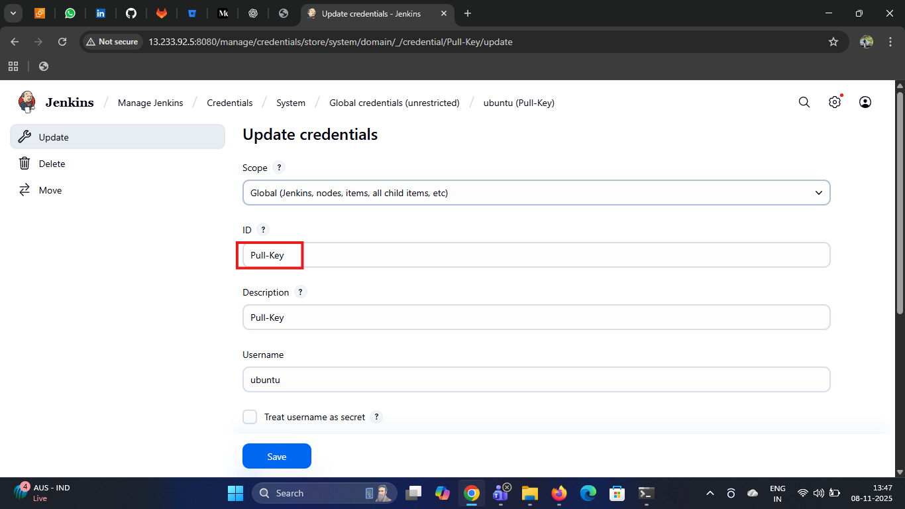
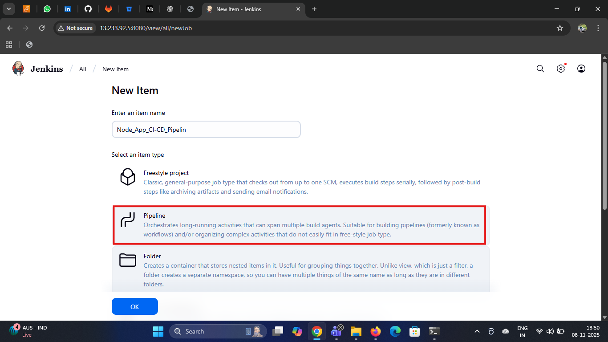
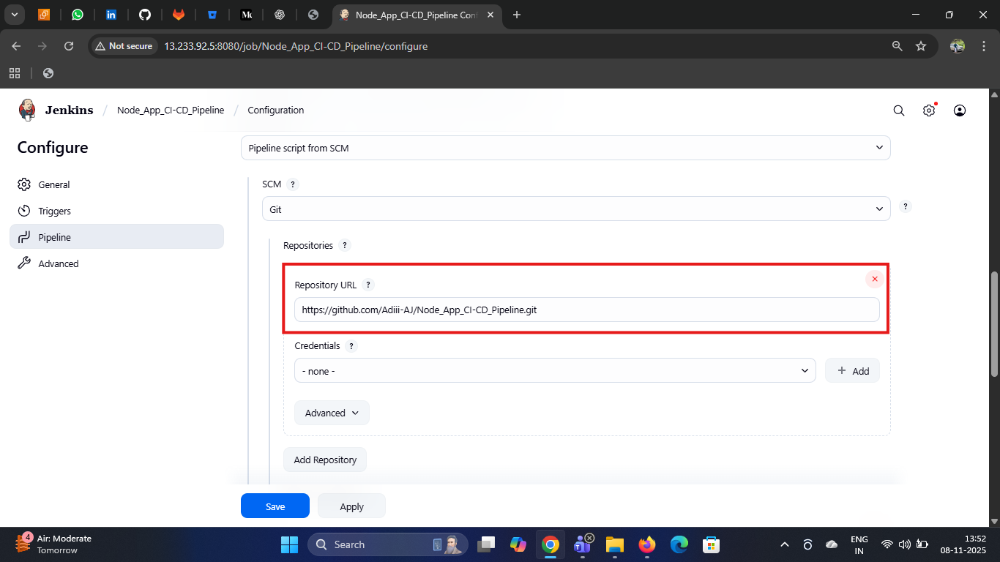
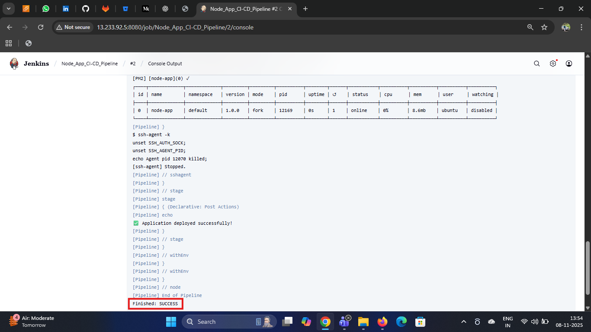
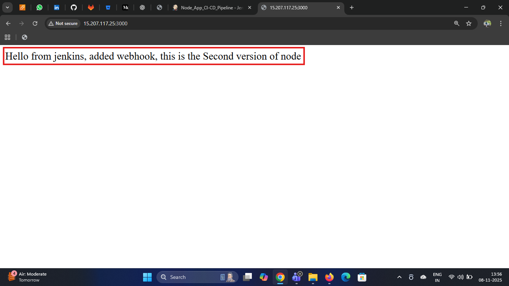

# Node_App_CI-CD_Pipeline with Webhook

This project shows the CI/CD process for a Node.js application using Jenkins + GitHub Webhooks.

Whenever new code is pushed to GitHub, Jenkins will automatically build, test, and deploy the app.
Because of this, there is no need for manual deployment.

This setup demonstrates important DevOps concepts like automation, version control, and continuous delivery — helping teams deploy faster and more reliably.


### Tools & Technologies
* __Jenkins__ – For continuous integration and delivery automation
* __Node.js & npm__ – For building and running the application
* __Git & GitHub__ – For version control and webhook triggers
* __PM2__ – For process management and application restart
* __Linux Server(Ubuntu)__ – For remote deployment and configuration

### Prerequisites

* GitHub repository for your app.
* Jenkins server (Ubuntu) reachable by your Git host and target servers
* Jenkins plugins (at minimum):
  * Pipeline
  * Git 
  * GitHub
  * SSH Agent (for SSH-based deploys)

* Target EC2 server (node) with SSH access 
* Node.js application source code hosted on a Git repository (e.g., GitHub).

### High-level CI/CD Flow

1. Developer pushes code to main (or feature branch).

2. Github webhook triggers Jenkins.

3. Jenkins pulls code, runs npm ci, runs tests.
4. If tests pass, Jenkins builds the app (if there's a build step).

5. Jenkins deploys the new version to the target:

6. SSH into server, install dependencies, restart process (pm2).
7. Post-deploy smoke tests and notifications.

### Step-1: Launch EC2s
Lauch two EC2s in same VPC(default)

* __Jenkins Server__
   * Add port *_8080 in_* Security Group

* __Target Server__
  * Add port *_22_* & *_3000_* in security Group
  * install nodejs, npm and pm2 (manually)
  ```
  sudo apt update
  sudo apt install nodejs npm -y
  sudo npm install -g pm2
  ```


### Step-2: Create Repository on GitHub
* Create a repository on Github
  * Name: `Node_App_CI-CD_Pipeline`
  * Branch: `main`



* Add __Webhooks__
  * Payload URL : `http://<Jenkin-Server-PUBLIC-IP>:8080/github-webhook/`



### Step-3: Add Credentials

__Manage Jenkins → Credentials → System → Global__:
* Create New Credentails
  * Scope:  Global
  * id: `Pull-Key`
  * description: `Pull-Key`
  * username: `ubuntu`
  * private key: `Your-Private-Key`



### Step-4: Create Item
* name: `Node_App_CI-CD_Pipeline`
* item-type:*_Pipeline_*



* Enable Trigger: GitHub hook trigger for GITScm polling
* Defination: Pipeline script from SCM
* SCM: Git
* Repository: `https://github.com/Adiii-AJ/Node_App_CI-CD_Pipeline.git`
* Branch: main
* Script Path: `Your-jenkinsfile-name`



### Step-5: Write Jenkinsfile
```
pipeline {
    agent any

    environment {
        SERVER_IP      = '15.207.117.25'
        SSH_CREDENTIAL = 'Pull-Key'
        REPO_URL       = 'https://github.com/Adiii-AJ/Node_App_CI-CD_Pipeline.git'
        BRANCH         = 'main'
        REMOTE_USER    = 'ubuntu'
        REMOTE_PATH    = '/home/ubuntu/node-app'
    }

    stages {
        stage('Clone Repository') {
            steps {
                git branch: "${BRANCH}", url: "${REPO_URL}"
            }
        }

        stage('Upload Files to EC2') {
            steps {
                sshagent([SSH_CREDENTIAL]) {
                    sh """
                        ssh -o StrictHostKeyChecking=no ${REMOTE_USER}@${SERVER_IP} 'mkdir -p ${REMOTE_PATH}'
                        scp -o StrictHostKeyChecking=no -r * ${REMOTE_USER}@${SERVER_IP}:${REMOTE_PATH}/
                    """
                }
            }
        }

        stage('Install Dependencies & Start App') {
            steps {
                sshagent([SSH_CREDENTIAL]) {
                    sh """
                        ssh -o StrictHostKeyChecking=no ${REMOTE_USER}@${SERVER_IP} '
                            cd ${REMOTE_PATH} &&
                            npm install &&
                            pm2 start app.js --name node-app || pm2 restart node-app
                        '
                    """
                }
            }
        }
    }

    post {
        success {
            echo '✅ Application deployed successfully!'
        }
        failure {
            echo '❌ Deployment failed.'
        }
    }
}
```
__NOTE:__ Replace `SERVER_IP`, `SSH_CREDENTIAL`, `REPO_URL`, and `REMOTE_PATH` with your actual values.

### Step-6: Push code and Jenkins file to Repository
push Nodejs application on github repository
```bash
git init
git add .
git commit -m "Added All Files"
git push -u origin main
```
Now we pushed code to GitHub, a webhook instantly notifies the Jenkins server. Jenkins then automatically pulls the latest code, installs dependencies, runs tests, builds the application, and deploys it to the target server



### Step-7: Browse Application on browser
open browser and enter
```http://<Node-Server-Public-Ip>:3000```



### Conclusion
Using Jenkins CI/CD with GitHub Webhooks for deploying a Node.js app makes the whole process completely automatic and fast. Every code push triggers build, test and deploy steps — removing manual work and reducing errors.

This improves code quality, supports team collaboration, and gives real Continuous Integration + Continuous Deployment. Overall, Jenkins makes Node.js deployments consistent, scalable and DevOps friendly.